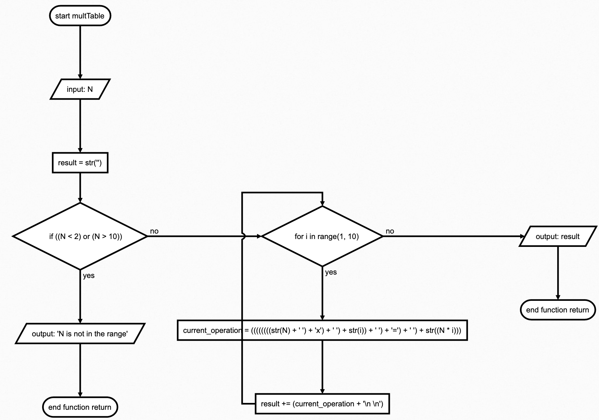
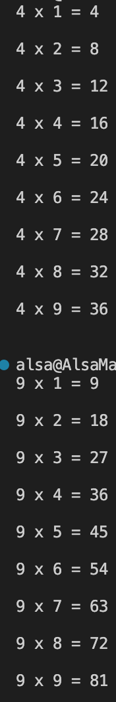

# Quizz 12
### Task
Create a function that receives a integrer 2<N<10, and return in a string the multiplication table for the number up to 9.

### Example:
N=2, return 2x1=2, 2x2=4, 2x3=6, 2x4=8, 2x5=10, 2x6=12, 2x7=14, 2x8=16, 2x9=18

### Script
```.py
def multTable(N):
    result = str("""""")
    if N < 2 or N > 10:
        return "N is not in the range"
    else:
        for i in range(1, 10):
            current_operation = str(N) + " " + "x" + " " + str(i) + " " + "=" + " " + str(N*i)
            #adding the current operation to the result
            result += current_operation + """
            
"""
    return result

print(multTable(94))
```


 

 **Fig. 1** My flow diagram definition

 

 **Fig. 1** Proof