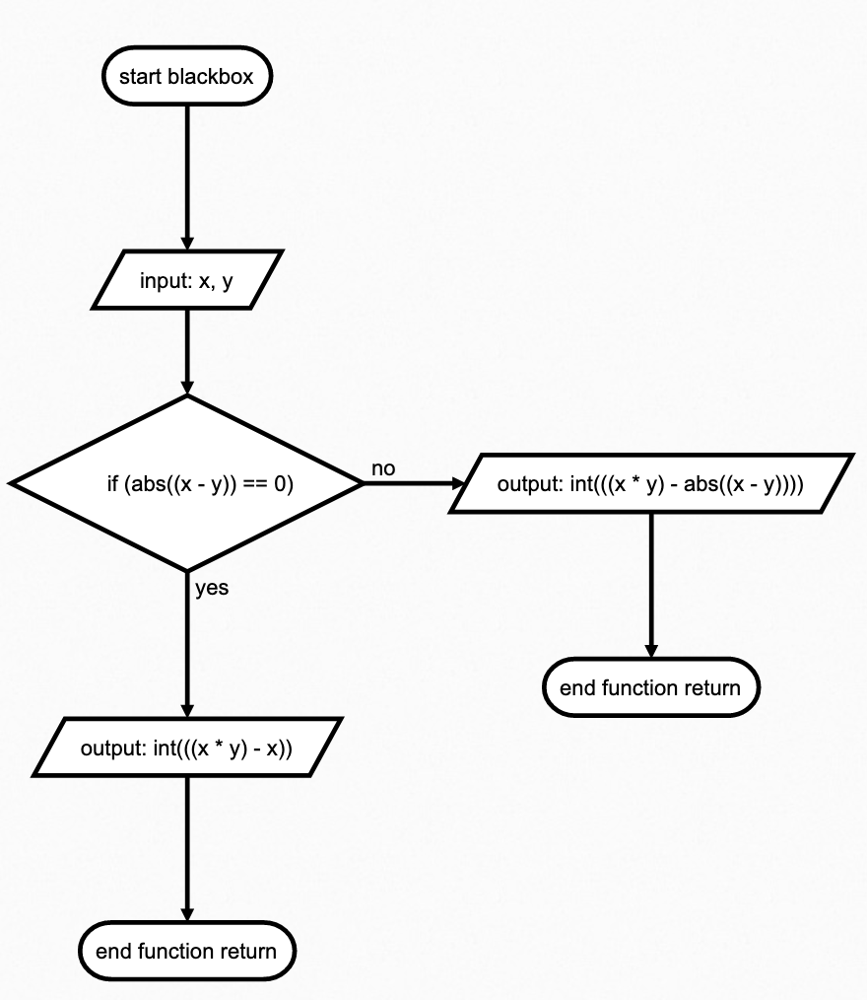
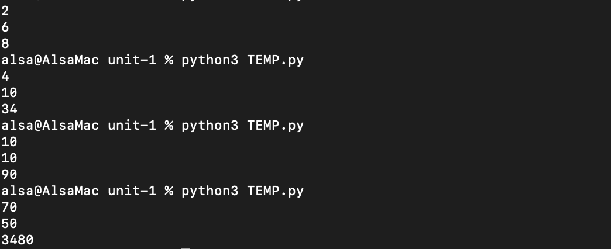

# Quizz 1

#### Input and result of the blackbox
'''
2,  6   = 8
4,  10  = 34
10, 10  = 90
70, 50  = 3480
'''

### Code
```python
def blackbox(x, y):
    if abs(x-y) == 0:
        return int((x*y)-x)
    else:
        return int((x*y)-abs(x-y))

x = int(input())
y = int(input())
print(blackbox(x, y))
```
 

 **Fig. 1** My flow diagram definition

 

 **Fig. 1** Proof