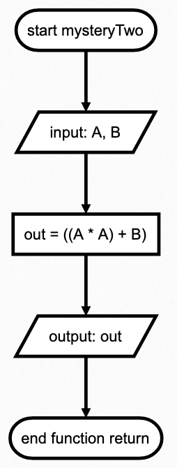
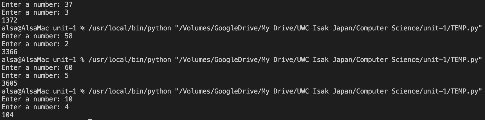

# Create a function that receive one input and produce the output shown in the table below
| Input         | Output |
|---------------|--------|
| 37,   3       | 1372   |
| 58,   2       | 3366   |
| 60,   5       | 3605   |
| 10,   4       | 1004   |

# Script
``` .py
out = mysteryTwo(A=10, B=4)
print(out)

def mysteryTwo(A, B):
    
    return out
```



 **Fig. 1** Flochart

 

 **Fig. 1** Proofs
 