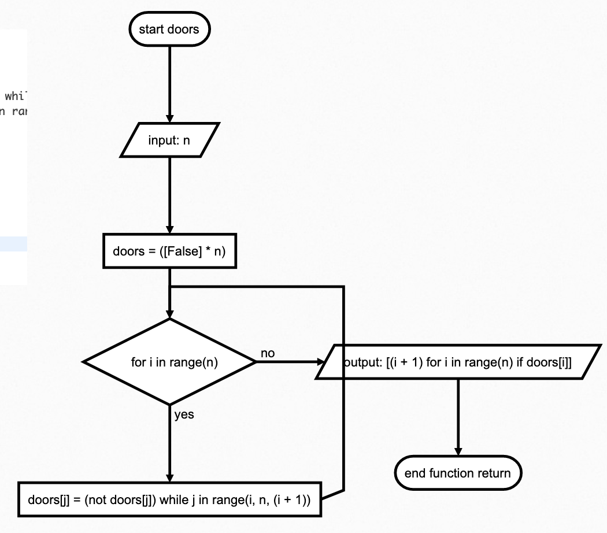
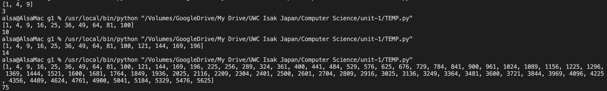

# Quizz 15
There are N closed doors in a school and N student present. The first student opens each door. The second student flips (open <-> close) every second door. The third student flips every third door, and so on.

### Script
```.py
def doors(n):
    doors = [False] * n
    for i in range(n):
        for j in range(i, n, i + 1):
            doors[j] = not doors[j]
    return [i + 1 for i in range(n) if doors[i]]

number = 100
print(doors(number))
print(len(doors(number)))
```



 **Fig. 1** Flochart

 

 **Fig. 1** Proofs
 
