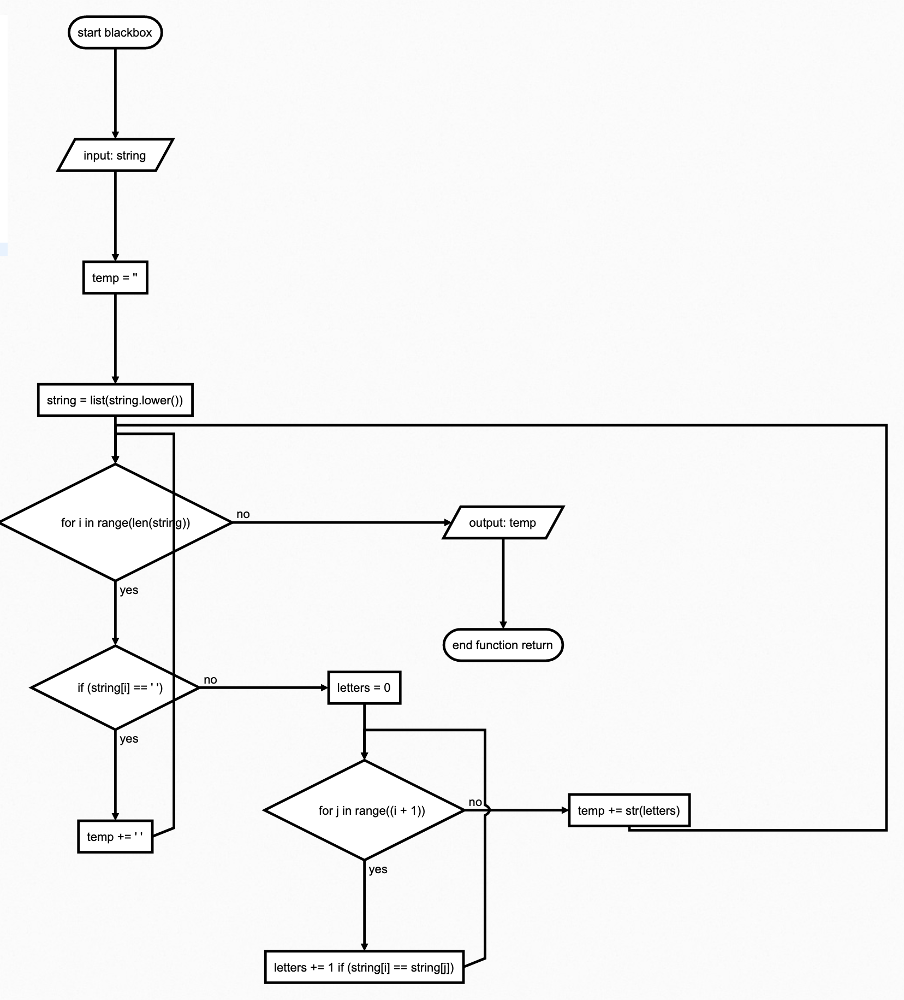
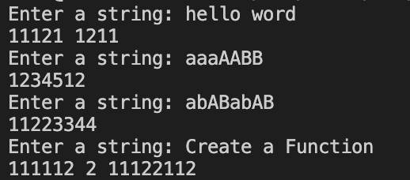

# Quizz 16
### Create a function that produces the ouput given the input shown below.

hello word = 1112 12131
aaaAABB = 12345612 
abABabAB = 11223344
Create a Function = 111112 2 1122111

### Script 
```.py
def blackbox(string):
    temp = ""
    string = list(string.lower())
    for i in range(len(string)):
        if string[i] == " ":
            temp += " "
        else:
            letters = 0
            for j in range(i+1):
                if string[i] == string[j]:
                    letters += 1
            temp += str(letters)

    return temp
while True:
    string = input("Enter a string: ")
    print(blackbox(string))
```


 **Fig. 1** Flochart

 

 **Fig. 1** Proofs