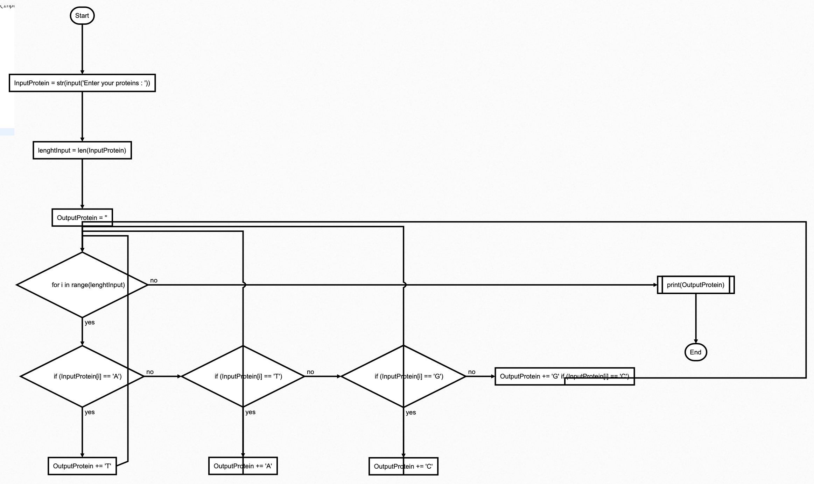

# QUIZZ-3
HL:
``` .py
# Quizz 3
InputProtein = str(input("Enter your proteins : "))
lenghtInput = len(InputProtein)
OutputProtein = ""
for i in range(lenghtInput):
    if InputProtein[i] == "A":
        OutputProtein += "T"
    elif InputProtein[i] == "T":
        OutputProtein += "A"
    elif InputProtein[i] == "G":
        OutputProtein += "C"
    elif InputProtein[i] == "C":
        OutputProtein += "G"
    else:
        print("Invalid Caracter")
        exit(0)
print(OutputProtein)
```


 **Fig. 1** Flowchart