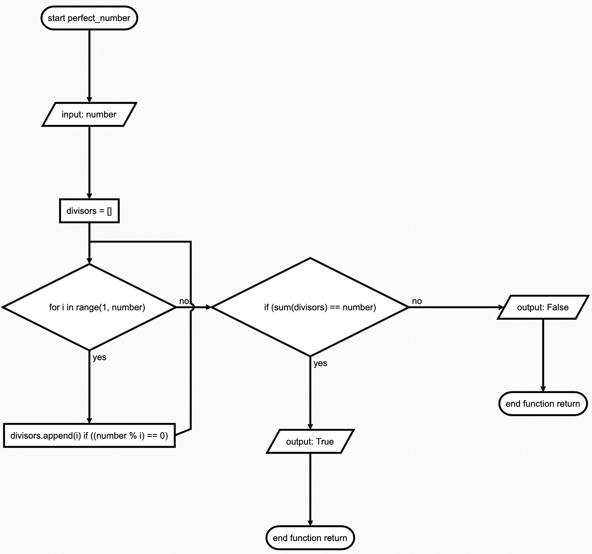

# QUIZZ-4
### Perfect number checker
'''python
#make i script that checks if a number is perfect or not
#perfect number is a number that is equal to the sum of its divisors
#example: 6 is a perfect number because 6 = 1 + 2 + 3

#setting up the function
def perfect_number(number):
    #setting up the list
    divisors = []
    #setting up the for loop
    for i in range(1, number):
        if number % i == 0:
            divisors.append(i)
    #setting up the if statement
    if sum(divisors) == number:
        return True
    else:
        return False
#get the user input number
inputnumber = int(input("Enter a number: "))
#call the function
if perfect_number(inputnumber):
    #if the number is perfect print this
    print("The number is perfect")
else:
    #if the number is not perfect print this
    print("The number is not perfect")
'''

 **Fig. 1** Flowchart main script

 

 **Fig. 2** Flowchart perfect_number function

 

 **Fig. 3** Proof
