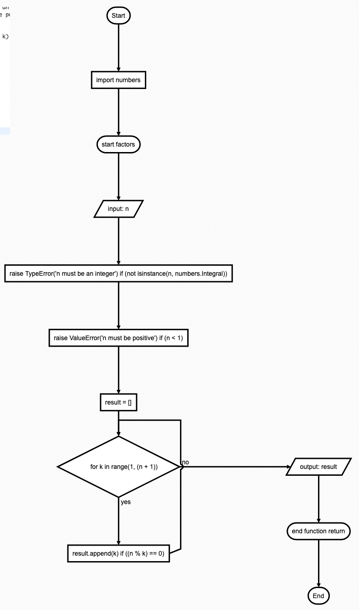

# Quizz 5
### Print the factors of a number
``` .py
import numbers

# print all factors of a number
def factors(n):
    if not isinstance(n, numbers.Integral):
        raise TypeError('n must be an integer')
    if n < 1:
        raise ValueError('n must be positive')
    result = []
    for k in range(1, n + 1):
        if n % k == 0:
            result.append(k)
    return result

n = input("Enter a number: ")
print(factors(int(n)))
``` .py


 **Fig. 1** Flow diagram

 

 **Fig. 2** Proof
