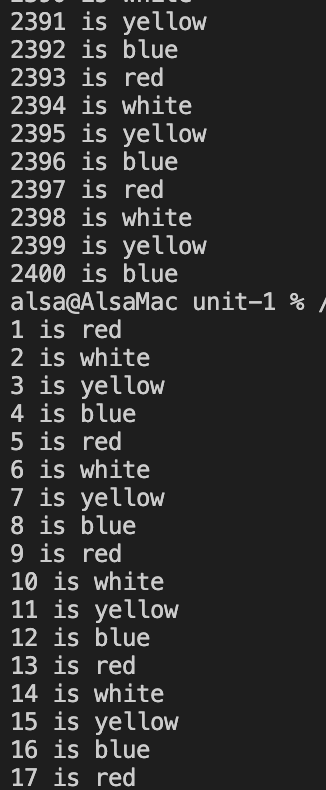
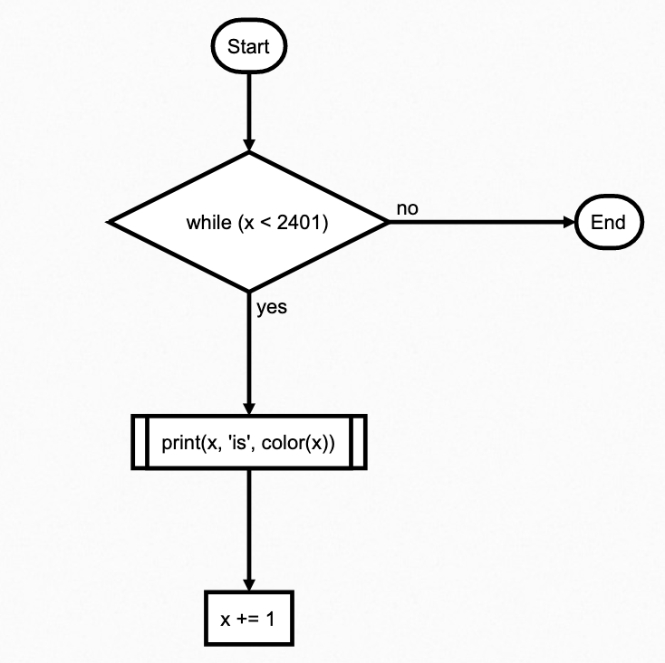
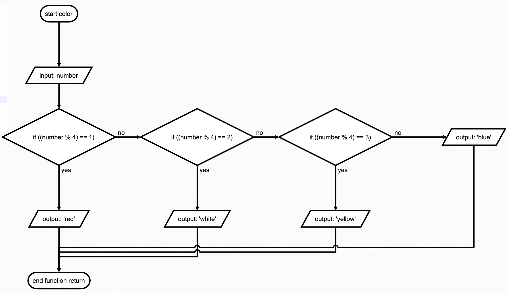

# Task 1
Task 1: Create a program and the flow diagram that shows the colors of all the lockers from 1 to 2400
```.py
def color(number):
    if number % 4 == 1:
        return "red"
    elif number % 4 == 2:
        return "white"
    elif number % 4 == 3:
        return "yellow"
    else:
        return "blue"
x = 1
while x < 2401:
    print(x, "is",color(x))
    x += 1
```
### Proof

 **Fig. 1** Proof

 ### Flow Diagram

 **Fig. 1** Flow Diagram of color definition

  ### Flow Diagram

 **Fig. 1** Flow Diagram of color definition
