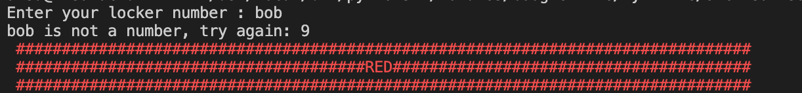

# Task 2:
Task 2: Using the program above, create another program that allows the user to enter a number and the program outputs the color that should be used in the locker.
### v.1
```.py
number = int(input("Input a locker number : "))
if number % 4 == 1:
    color = "red"
elif number % 4 == 2:
    color = "white"
elif number % 4 == 3:
    color = "yellow"
else:
    color = "blue"
print("The color is", color)
```
### v.2
```.py
def color(number):
    if number % 4 == 1:
        return "red"
    elif number % 4 == 2:
        return "white"
    elif number % 4 == 3:
        return "yellow"
    else:
        return "blue"


print("The color is", color(int(input("Input a locker number : "))))
```
### v.3
```.py
def color(number):
    if number % 4 == 1:
        return "red"
    elif number % 4 == 2:
        return "white"
    elif number % 4 == 3:
        return "yellow"
    else:
        return "blue"


def checker():
    number = input("Enter your locker number : ")
    errors = 0
    error_limit = 3
    while not number.isnumeric():
        number = input(number + " is not a number, try again: ")
        errors = errors + 1
        if errors == error_limit:
            print("You are a failure")
            exit("buy a brain")
    return int(number)
color = color(checker())
print("################################################################################")
print(color.upper().center(80, '#'))
print("################################################################################")
```
### v.4
```.py
def prRed(skk): print("\033[91m {}\033[00m" .format(skk))
def prWhite(skk): print("\033[97m {}\033[00m" .format(skk))
def prYellow(skk): print("\033[93m {}\033[00m" .format(skk))
def prBlue(skk): print("\033[94m {}\033[00m" .format(skk))

def color(number):
    if number % 4 == 1:
        return "red"
    elif number % 4 == 2:
        return "white"
    elif number % 4 == 3:
        return "yellow"
    else:
        return "blue"


def checker():
    number = input("Enter your locker number : ")
    errors = 0
    error_limit = 3
    while not number.isnumeric():
        number = input(number + " is not a number, try again: ")
        errors = errors + 1
        if errors == error_limit:
            print("You are a failure")
            exit("buy a brain")
    return int(number)
color = color(checker())
if color == "red":
    prRed("################################################################################")
    prRed(color.upper().center(80, '#'))
    prRed("################################################################################")
if color == "white":
    prWhite("################################################################################")
    prWhite(color.upper().center(80, '#'))
    prWhite("################################################################################")
if color == "yellow":
    prYellow("################################################################################")
    prYellow(color.upper().center(80, '#'))
    prYellow("################################################################################")
if color == "blue":
    prBlue("################################################################################")
    prBlue(color.upper().center(80, '#'))
    prBlue("################################################################################")
```
### Proof

 **Fig. 1** Proof