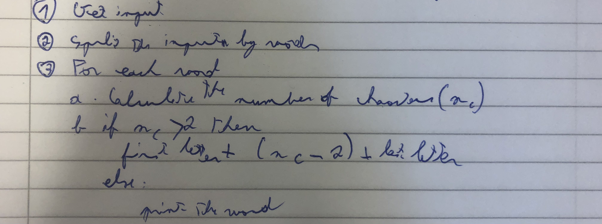

# Lesson 2
### Quizz 001 Solution



 **Fig. 1** This is the solution to the black box
 
 **Fig. 1** shows my solution to quiz 001. The procedure to generate the outputs below are
 
| Input         | Output |
|---------------|--------|
| International | I11l   |
| My            | My     |
| Cat           | C1t    |
| (1b@!)        | (4)    |

### Quizz 001 Script

``` .py
import re
x = str(input())
if x == "":
    print("Empty String")
    exit()
wordcount = (len(re.findall(r'\w+',x)))
x = x.split()
for item in x:
    item = str(item)
    lw = int(len(item))
    inter = str(lw -2)
    if lw < 3:
        print(item)
    else:
        str = item
        len = len(str)
        fc = str[:1]
        lc = str[len-1:len]
        print("".join([fc, inter, lc]))
```

** My blackbox
| Input     | Output    |
|-----------|-----------|
| Bob       | CfC       |
| My        | My        |
| 1         | 1         |
| 2022      | 3133      |
| Hamburger | Ibfcmshfs |
| #         | #         |
