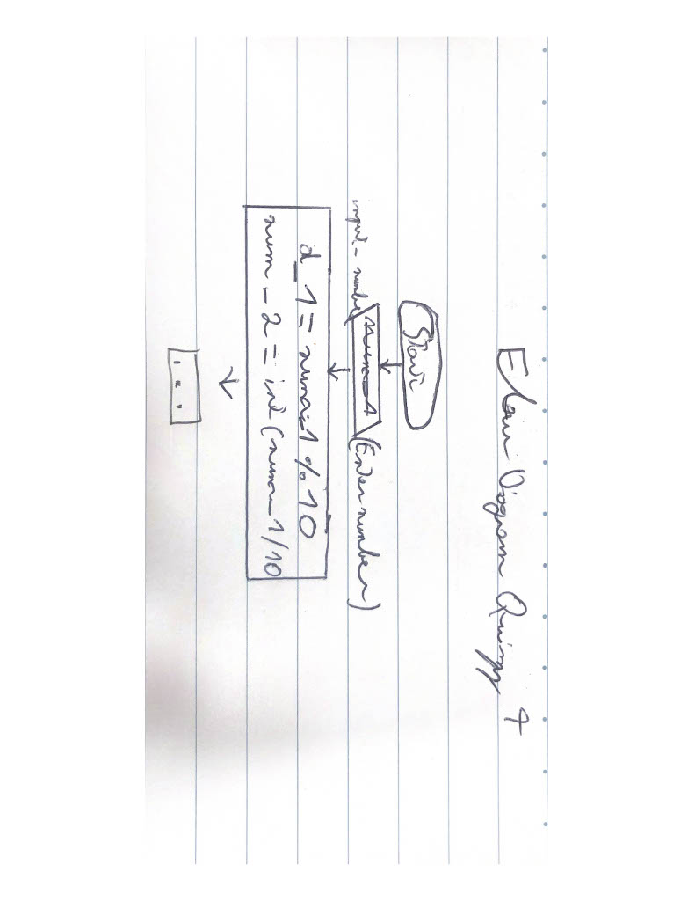

# Lesson 6
### QUIZZ-4
In the quizz folder
### Flow Diagram


 **Fig. 1** My flow diagram
### Number tester
```.py
def checker(what):
    question = (what + " : ")
    number = input(question)
    errors = 0
    error_limit = 3
    while not number.isnumeric():
        question = (what + number)
        number = input(question + " is not a number, try again: ")
        errors = errors + 1
        if errors == error_limit:
            print("You are a failure")
            exit("buy a brain")
    if int(errors) > 0:
        print("You had", errors, "errors")
    return int(number)


start = checker("Start")
steps = checker("Steps")
end = checker ("End")
while start < end + 1:
    print(start)
    start = start + steps
```
### Fun Game
```.py
import random


def checker(what):
    number = input(what)
    errors = 0
    error_limit = 3
    while not number.isnumeric() or int(number) > 100 :
        number = input(what + "(number > 0 and number < 100) : ")
        errors = errors + 1
        if errors == error_limit:
            print("You are a failure")
            exit("buy a brain")
    if int(errors) > 0:
        print("You had", errors, "errors")
    return int(number)


n = random.randint(0, 100)
guess = 0
tentatives = 0
while guess != n:
    guess = checker("Guess a number between 0 and 100: ")
    if guess < n:
        print("Higher!")
        tentatives = tentatives + 1
    elif guess > n:
        print("Lower!")
        tentatives = tentatives + 1
    else:
        print("You got it!")
        print ("You needed", tentatives, "tentatives")

```

