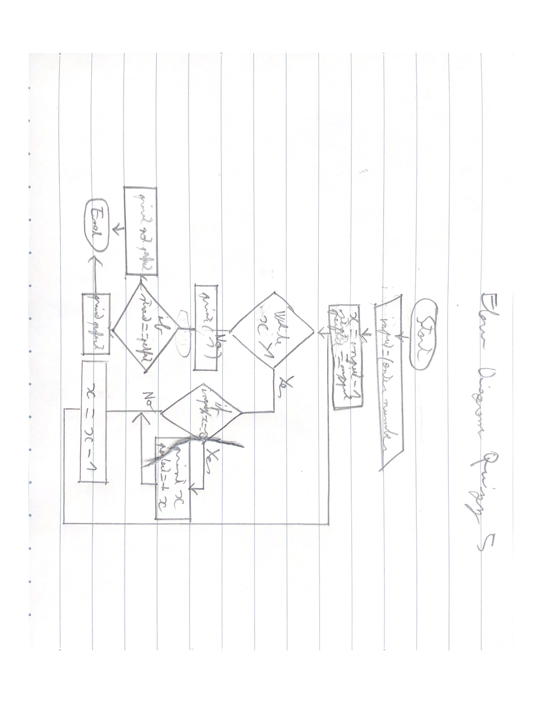

# Lesson 7
### QUIZZ-5
In the quizz folder
### Flow Diagram


 **Fig. 1** My flow diagram
### Program of quizz
```.py
tmp = int(input("Enter a number: "))
x = tmp - 1
input = tmp
perfect = 1
while x > 1:
    if tmp % x == 0:
        tmp = tmp / x
        perfect = perfect + x
        print(x)
    x = x - 1
print(1)
if input == perfect:
    print("Perfect")
else:
    print("Not perfect")
```
### 123 v1
```.py
x = int(input("Enter an amount of number: "))
tmp = 0
while x != 0:
    x = x - 1
    if tmp == 4:
        tmp = 0
    print(tmp)
    tmp = tmp + 1

```
### 123 v2
```.py
x = int(input("Enter an amount of number: "))
while x != 0:
    print(x % 4)
    x = x - 1

```
### 123 v3
```.py
start_number = int(input("Enter an amount of number: "))
y = int(input("Enter a number to go: "))
x = 0
while start_number > x:
    print(x % y)
    x = x + 1
```
